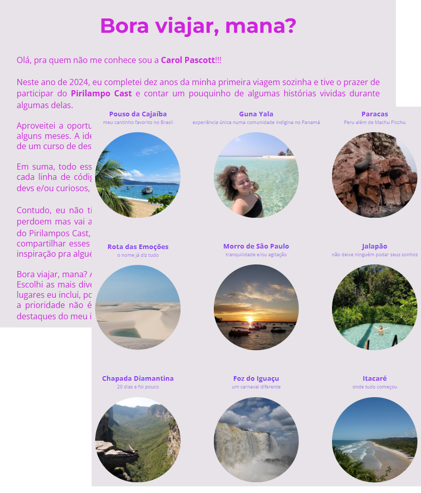
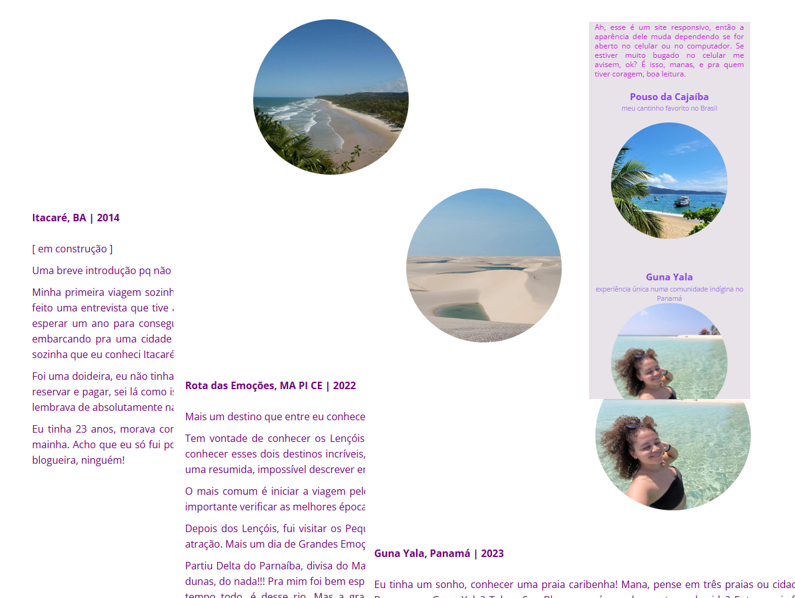

<h1 align="center">Bora viajar, mana? </h1>

Esse projeto é a junção de duas coisas que eu amo:<b> viagens e tecnologia.</b> 

Este seria o desafio do Land 09, do Explorer da Rocketseat, mas eu me empolguei!
 
A primeira versão, que está em outro repositório, eu fiz em html e css e era composto por uma única página.

Já este  projeto eu fiz com intuito de ser um blog pessoal, então tem a página inicial e mais nove. Utilizei ReactJS e Vite. O deploy foi feito com Vercel.    

O site pode ser acessado através deste [link](https://boraviajarmana.vercel.app)

  

    

